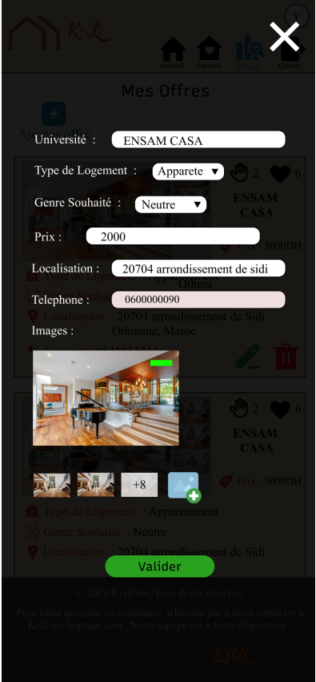

# KriLi
- **Frontend** : Retrouvez le code source du frontend sur GitHub via le lien suivant : [Krili-front-end](https://github.com/zetatiabdelhakim/Krili-front-end)

## Overview

Krili is a platform designed to connect university students with suitable housing options. It serves as a bridge between students seeking accommodation and landlords offering properties. The platform ensures a seamless experience for all users, including students, landlords, administrators, and visitors.

## Main Actors

### 1. University Students

**Primary Users**: Students searching for housing that meets their needs.

**Actions**:
- Browse available housing listings
- Filter listings by university, price, and type of housing
- Add listings to favorites
- Show interest in listings through an interactive feature

### 2. Housing Landlords

**Primary Users**: Landlords publishing housing listings for university students.

**Actions**:
- Publish housing listings with details such as target university, price, contact information, location, and housing preferences
- Manage listings (modify or delete)

### 3. Platform Administrators

**Management Users**: Administrators who monitor and manage the Krili platform.

**Actions**:
- Verify listings to ensure quality and accuracy
- Manage users and handle technical issues

### 4. Unregistered Users

**Visitors**: People browsing the platform without registering.

**Actions**:
- Limited browsing of housing listings
- Restricted access to features reserved for registered users

## Features

- **Housing Listings**: Comprehensive listings of available housing tailored to university students.
- **Filtering Options**: Advanced filtering by university, price, and type of housing to find the most suitable options.
- **Favorites**: Ability to save preferred listings for easy access later.
- **Interest Expression**: Interactive feature allowing students to show interest in specific listings.
- **User Management**: Easy management of listings and user interactions by landlords and administrators.
- **Admin Tools**: Robust tools for administrators to monitor platform activity and address issues.

## Getting Started

### Prerequisites

- A modern web browser
- Internet connection

## Usage

1. **For Students**:
   - Search for housing by using the filter options.
   - View detailed information about each listing.
   - Save preferred listings to favorites and show interest in desired properties.

2. **For Landlords**:
   - Publish new housing listings with all necessary details.
   - Manage existing listings by modifying or deleting them as needed.

3. **For Administrators**:
   - Monitor and verify new listings.
   - Manage user accounts and resolve technical issues.

4. **For Visitors**:
   - Browse available listings with limited access.
   - Register to unlock full functionality.

